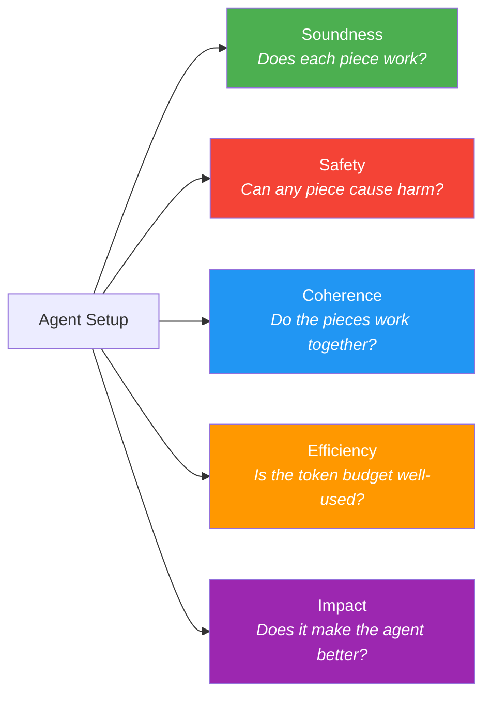
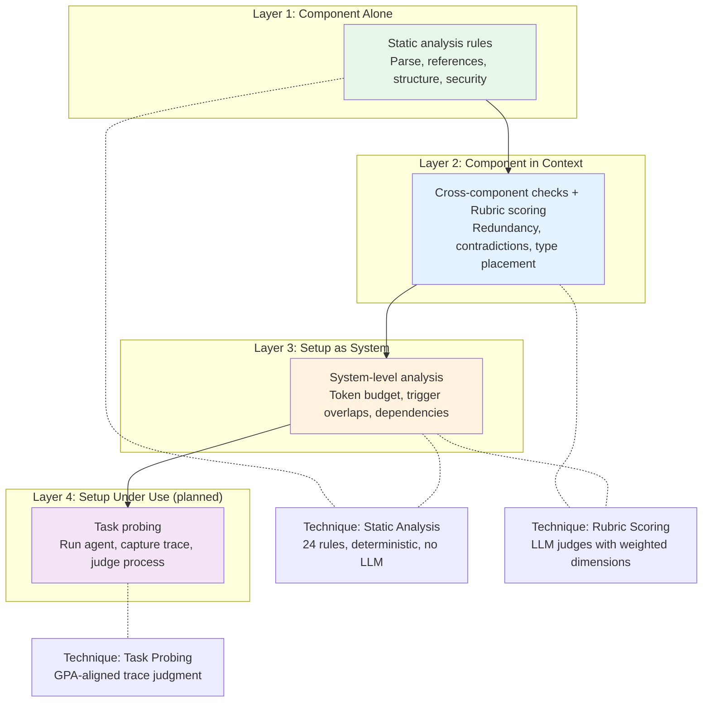
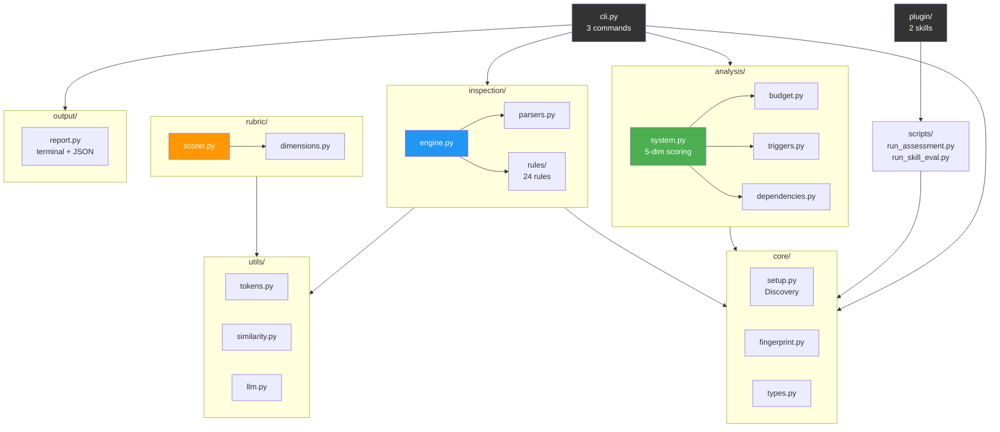

# harness-eval-lab

Evaluate AI agent setups across 5 dimensions: Soundness, Safety, Coherence, Efficiency, Impact.

## What it does

Most agent evaluation tools test whether a **skill** completes a task correctly. This tool evaluates the **entire setup** that surrounds the agent: CLAUDE.md, skills, commands, hooks, MCP configs, and sub-agents.

It evaluates setups across five dimensions: **Soundness** (does each piece work?), **Safety** (can any piece cause harm?), **Coherence** (do the pieces work together?), **Efficiency** (is the token budget well-distributed?), and **Impact** (does the setup actually help the agent?).

Two evaluation modes:

- **`eval-setup`**: Evaluate the full setup. Inspects all components, runs system-level analysis (token budget, trigger overlaps, dependencies), and produces a 5-dimension scorecard.
- **`eval-skill`**: Deep-evaluate a single skill, both individually (is it well-built?) and in context of the setup (is it redundant? does it overlap?).

## Framework Overview

### Evaluation Dimensions



### Analysis Layers



### eval-setup Pipeline


## Install

```bash
uv sync
```

With LLM support (for rubric scoring in `eval-skill`):

```bash
uv sync --extra llm
```

## Usage

### As a CLI

```bash
# Evaluate the full setup
harness-eval-lab eval-setup /path/to/project

# Deep-evaluate one skill (with setup context)
harness-eval-lab eval-skill /path/to/skills/my-skill --context /path/to/project

# Quick static scan (no LLM, fast, good for CI)
harness-eval-lab scan /path/to/project
harness-eval-lab scan /path/to/project --preset strict --format json
```

### As a Claude Code plugin

Install by adding the plugin directory, then use:

- `/eval-setup` - evaluate the full setup, get a 5-dimension scorecard
- `/eval-skill <skill-name>` - deep-evaluate one skill in context

## CLI Commands

| Command | Description |
|---------|-------------|
| `eval-setup` | Full setup evaluation: inspect + system analysis + 5-dimension scorecard |
| `eval-skill` | Deep-evaluate a single skill individually and in context |
| `scan` | Quick static analysis (24 rules, no LLM, deterministic) |

## Plugin Skills

| Skill | Description |
|-------|-------------|
| `/eval-setup` | Evaluate the full agent setup, present scorecard conversationally |
| `/eval-skill` | Deep-evaluate a single skill with contextual analysis |

## Inspection Rules (24)

| Category | Rules | What they check |
|----------|-------|-----------------|
| Structural | 1 | SKILL.md exists |
| Frontmatter | 3 | Description required/quality, format valid |
| Content | 3 | Duplicate detection (TF-IDF), broken references, token budget |
| Security | 2 | Credential access, prompt injection (16 patterns) |
| Commands | 6 | Description, script exists, duplicates, credentials, injection, skill overlap |
| CLAUDE.md | 2 | Exists, skill duplication |
| Hooks | 1 | Structure validation, dangerous patterns |
| Agents | 6 | Description, skills exist, tool format, constraint matching, credentials, injection |

Three presets: `recommended` (default), `strict`, `security`.

## Rubric Dimensions

Scoring dimensions per component type (weights sum to 1.0):

- **Skills:** Specificity, Redundancy, Trigger Quality, Token Efficiency, Content Quality
- **Commands:** Description, Instruction Clarity, Script Integrity, Scope, Token Efficiency, Redundancy, Robustness
- **CLAUDE.md:** Conciseness, Signal-to-Noise, Skill Separation, Structure, Conflict-Free
- **Agents:** Specificity, Constraint Clarity, Zero-Trust Integrity, Token Efficiency, Content Quality
- **Hooks:** Safety, Reliability, Scope, Performance

## Development

```bash
uv sync --extra dev
uv run pytest
uv run ruff check src/ tests/
```

## Architecture



### Module Layout

```
src/harness_eval_lab/
    cli.py              # Click CLI (3 commands: eval-setup, eval-skill, scan)
    config/
        presets.py      # Rule presets (recommended/strict/security)
    core/
        types.py        # ComponentType enum, Setup, ParsedComponent
        setup.py        # Setup discovery (walks dirs, finds components)
        fingerprint.py  # SHA256 setup fingerprinting
    inspection/
        parsers.py      # Component parsers (skill, command, CLAUDE.md, hooks, agent)
        engine.py       # Lint orchestration and rule runner
        registry.py     # Pluggable rule registry
        types.py        # Finding, InspectionResult, rule types
        suppression.py  # Inline suppression comments
        fixer.py        # Auto-fix application
        rules/          # 24 rules in 8 categories
    rubric/
        dimensions.py   # Weighted dimension definitions per type
        prompts.py      # LLM prompt templates
        scorer.py       # RubricScorer with response parsing
        types.py        # DimensionScore, RubricResult
    analysis/
        system.py       # System-level analysis + 5-dimension scoring
        budget.py       # Token budget distribution analysis
        triggers.py     # Trigger overlap detection
        dependencies.py # Dependency mapping and broken references
        types.py        # SetupComparison, Correlation, CrossAnalysisResult
    experiment/         # Task probing (planned, not yet implemented)
    output/
        report.py       # Report generation (terminal + JSON)
    utils/
        tokens.py       # Token counting (tiktoken)
        similarity.py   # TF-IDF cosine similarity
        parsing.py      # YAML frontmatter parsing
        llm.py          # LLM client abstraction (Gemini/Anthropic)

skills/                 # Plugin skills
    eval-setup/
        SKILL.md        # Instructions for /eval-setup
        scripts/        # Python scripts called by the skill
    eval-skill/
        SKILL.md        # Instructions for /eval-skill
        scripts/

.claude-plugin/
    plugin.json         # Plugin registration and metadata
```

## License

Apache-2.0
